# MolVision 🧬

**Professional 3D molecular visualization studio in the browser** — built with Three.js, Next.js 16 and WebGL2. Load any PDB/mmCIF structure and explore it with publication-quality cartoon ribbons, ball-and-stick models, gaussian molecular surfaces, **electron-density maps computed live from deposited structure factors**, crystal **symmetry mates**, a PyMOL-style selection language and command console.

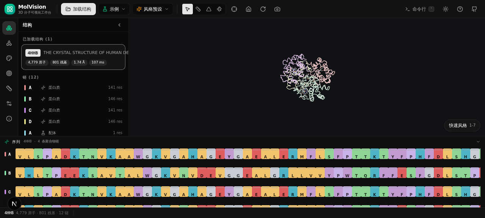

## ✨ Highlights

### Representations
| Style | Description |
|---|---|
| 🧬 **Cartoon ribbons** | Secondary-structure-aware ribbons — helices as rounded ribbons, β-sheets as flat arrows with tapered tips, loops as tubes, nucleic backbones as tubes with per-residue coloring |
| ⚪ **Ball & stick / sticks** | Per-bond two-tone cylinders (half-bond coloring), configurable radii |
| ⬤ **Space-fill (CPK)** | vdW-radius spheres, per-element Jmol palette |
| 〰️ **Wireframe** | GPU line segments |
| 🎈 **Molecular surface** | Metaball/gaussian implicit surface via marching cubes, per-atom vertex coloring, probe radius & opacity controls |
| ⚡ **Hydrogen-bond network** | Distance/angle geometry criteria (D-H…A ≤ 2.5 Å & ≥ 120° with H; D…A ≤ 3.5 Å without), dashed teal lines with endpoint markers, optional water-mediated bonds & selection-scoped display — press `B`. Structures ≥ 2,000 atoms are detected in a **background Web Worker** (UI never blocks, live progress badge) |
| 🎬 **NMR ensemble animation** | Multi-model PDB/mmCIF ensembles playback with smooth frame interpolation, speed control (2-30 fps), loop mode and frame scrubbing — press `P`, try `load 1d3z` |
| 🔀 **Structure superposition** | ChimeraX matchmaker-style alignment: Needleman-Wunsch sequence pairing + Horn quaternion rigid-body fit (Kabsch-equivalent) with per-CA RMSD report — `superpose 4HHB onto 2HHB`, one-click ⧉ button in the Structures panel, or the **matchmaker panel** with explicit chain-pair selection (`superpose 4HHB onto 1A3N chain A to A`). Aligned poses persist across sessions (rigid transform replay) |
| 🧪 **Interface contact analysis** | ChimeraX contacts-style: detect residue-residue contacts between two selections (heavy-atom distance ≤ cutoff, bonded pairs excluded), rendered as distance-coded lines (near = red, far = amber) — with a clickable **2D contact map**, interface-residue selection and per-side highlighting — `interface A B` (also `interface chain A chain B` / `interface :A :B`), `contacts chain A | within 8 of resn HEM 4.0` or the Analysis panel |
| 🌉 **Cross-structure contacts** | Detect interfacial contacts **between two different structures** (complex/docking interfaces): superpose first, then `xcontacts 1UBQ:chain A | 1D3Z:chain A 5.0` — violet result card with Top contact pairs + status-bar badge; A/B structure selectors with live atom counts in the Analysis panel |
| 🧱 **Cross-structure ΔSASA (xbsa)** | Buried solvent-accessible area **between two independent PDB entries**: `xbsa` reuses the xcontacts A/B masks, splices both structures' atoms into one joint coordinate set and runs three-pass SASA (A alone / B alone / A∪B) — the "free-ligand view" interface burial to compare against the in-complex `bsa`; per-side core residues selectable in the Analysis panel |
| 🌀 **DSSP secondary structure** | Kabsch–Sander backbone H-bond energies (ideal-geometry H placement, 0.03 Å validated) with helix/turn/bridge assignment — structures lacking HELIX/SHEET records get correct cartoons automatically; force recompute with `dssp` |
| 💧 **SASA solvent accessibility** | Shrake–Rupley algorithm (FreeSASA-equivalent, ProtOr/Bondi vdW radii, 1.4 Å water probe, 64-256 Fibonacci sphere points per atom): per-atom/per-residue areas, hydrophobic vs polar decomposition, Top exposed residues, and an **exposure color scheme** (buried blue → exposed orange-red) — `sasa 1.4 256` or the Analysis panel; structures ≥ 2,200 atoms compute in a **background Web Worker** |
| 🧱 **Interface ΔSASA (BSA)** | Buried solvent-accessible area between two selections — the rigorous interface criterion: three-pass SASA (A alone / B alone / complex) with core interface residues flagged at ΔSASA > 1 Ų (PDB standard) — run contacts first, then `bsa`; compare with distance-cutoff contacts in the Analysis panel |
| 🔄 **Superpose undo** | Revert any aligned structure back to its original deposited pose — `untransform 1D3Z` or the ↩ button on structure cards |
| 🎥 **Animation recording** | Record ensemble playback / rock / spin as 30fps WebM video via MediaRecorder canvas capture — toolbar ⏺ button or `record start` |
| 🫀 **Conformational morphing** | PyMOL `morph` equivalent: generate an interpolated trajectory object between two homologous structures — greedy chain pairing (NW scores) → per-residue atom-name matching → in-memory superposition (originals untouched) → smoothstep-eased ensemble frames (10–120) that plug straight into the ensemble player (`morph m1 = 1BQL 2LYZ 40` then `ensemble play`); same-entry conformers fall back to exact-index identity matching |
| 🌊 **Multi-state morphing** | Beyond pairwise: `morph multi m = 1BQL 2LYZ 2VB1 60` threads **3–8 conformational states through a Catmull-Rom spline** (each state independently superposed onto the reference pose, atoms intersected across all pairings) for smooth multi-state transitions — the frame scrubber can pause at any intermediate conformation; the ensemble badge distinguishes「多态 morph · N 态 · M 帧」 |
| 🎬 **Key-frame camera movies + timeline editor** | PyMOL `movie` equivalent built on view bookmarks: the toolbar 🎬 button or `movie edit` opens a **visual timeline editor** (bottom panel) — sync bookmarks into key-frame cards, **drag to reorder** (teal insertion indicator), per-segment duration stepper (0.6–20 s), loop count, 👁 per-keyframe camera preview, all persisted in localStorage; `movie play` (no seconds argument) cruises the edited timeline with per-segment durations, explicit `movie play 4 2` keeps the uniform-duration mode; in-viewport progress capsule shows the current segment; drag/wheel take-over or `Esc` gracefully stops; combine with `record start` to export the cruise as WebM video |
| 🗺️ **Electron density (2Fo−Fc)** | **Computed live from RCSB-deposited structure factors**: model phases (symmetry-expanded Gaussian density rasterization) + observed amplitudes → 3D FFT → marching-cubes isosurface/isomesh at adjustable σ levels, cropped around the model with periodic boundary wraparound — `map fetch 3ekj`, `map isolevel 1.5`, `map mesh|surface|both`; CCP4/MRC map files can be dragged in directly (mode 0/1/2, axis permutation, byte-order detection) |
| ⚖️ **Fo−Fc difference maps** | Classic model-validation difference density with **positive/negative dual isosurfaces** (green = positive peaks / missing atoms, red = negative peaks / misplaced atoms) — `map fofc 3ekj` or the Maps-panel kind toggle (**the structure is auto-fetched from RCSB as the phase model if not loaded** — including session-restore); crystallographic ±3σ convention, dual color pickers, and **independent positive/negative σ levels** (`map isolevel pos 3 / neg 2.5` or the dual sliders — PyMOL two-object isolevel workflow); once a map is loaded, an **in-viewport σ control card** (bottom-left) offers the same dual sliders + mesh/surface/both mode chips + visibility toggle without leaving the scene — the card is **draggable** (grip handle, double-click to snap back to the dock, position persisted); re-running `map fetch/fofc` with the same id skips recomputation (idempotent) |
| 🧵 **Putty B-factor tubes** | PyMOL `show putty` equivalent: tube radius continuously mapped to per-residue B-factors (sqrt scaling, smooth interpolation — thick = flexible, thin = rigid) covering **both protein (CA) and nucleic-acid (phosphate backbone) chains** with a unified B-range, B-cap slider to suppress outliers, pairs with the B-factor rainbow and an **auto-shown color-scale legend card** (B-value → color → tube-radius triple mapping, bottom-left overlay) — preset key `8` / `preset putty` / `show putty polymer` |
| ⚙️ **Worker-thread crystallography** | The entire SF-parse + 3D-FFT synthesis (~6–18 s for 256³ grids) runs in a **Web Worker** with zero main-thread blocking — the UI stays fully interactive (rotate, select, command line) while the map computes; automatic main-thread fallback for exotic environments |
| 🚦 **Heavy-task concurrency gate** | H-bond / SASA / ΔSASA / cross-structure ΔSASA / density-synthesis jobs share a **global 2-slot semaphore** — a third heavy task queues transparently (console logs `⏳ … 排队等待`) instead of piling onto busy workers, preventing memory spikes and CPU contention when analyses overlap; slots release on worker result / error / engine dispose (no deadlock paths) |
| 🔷 **Crystal symmetry mates** | PyMOL `symmetry` equivalent: parses CRYST1, supports all **65 chiral (Sohncke) space groups** (validated operation tables, lattice centering composed), generates rigid-transformed visual copies of every representation within a radius — `symmetry 20` / panel controls; persists across sessions |
| 👓 **Red-blue stereo** | Anaglyph stereo rendering (three.js AnaglyphEffect) — toolbar 👓 button or `stereo on`; wear red/cyan glasses for true depth |
| 🧰 **Object workflow** | PyMOL `create` / `split_chains` / `save`: promote any selection to an independent object (`create pocket = within 5 of resn HEM`), split a structure into per-chain-segment objects, export coordinates as PDB files (`save model.pdb chain A`) — created objects auto-register into session persistence |
| 🎛️ **Lighting & rendering controls** | Ambient / key / fill light intensity sliders, specular (gloss) toggle for matte publication-style rendering, `set ambient 0.5` · `set direct 2` · `set specular off` · `set fov 30` · `set quality high` · `set transparency 0.5` · `set stick_radius 0.2` |
| 🧭 **View control & bookmarks** | PyMOL `orient` (PCA principal-axis alignment), `get_view` / `set_view` camera JSON export/import, `png 4` high-res export, `count_atoms`, plus **view bookmarks**: save the current camera as a thumbnail card (`V` key or the right-edge bar), jump back with a smooth eased 650 ms transition (`Shift+1–9` / click / `view 2`), rename by double-click — persisted independently in localStorage, surviving reloads and structure clears; **bookmarks travel inside exported `.molvision` session files** |
| ✨ **Ray-traced still renders** | PyMOL `ray` equivalent: one-shot high-quality frame with **PCF soft shadows** (2048² map, scene-adaptive shadow camera fitted to the visible-atom bounding box) + **1.5× internal supersampling** + SSAO-aware composer path, exported as PNG — `ray` / `ray 1920` or the camera-menu 「Ray 级渲染」 item; all state (lights, canvas size, material programs) is transparently restored afterwards |
| 📏 **Resizable side panel** | Drag the right edge of the left panel to resize (232–460 px, emerald grip on hover, double-click to reset) — width persists in localStorage; ideal for wide chain/residue lists |
| 🎓 **Guided demo tours** | Six scripted, hands-on tutorials that drive the app for you — each step explains the science, executes the real commands (echoed in the console) and shows a copyable command chip: **Quickstart** (hemoglobin: load → cartoon → chain coloring → heme pocket → H-bonds), **Drug target** (SARS-CoV-2 Mpro + N3 inhibitor: pocket → dimer interface → ΔSASA), **Crystallography** (putty tubes → live Fo−Fc difference map → dual-σ), **NMR dynamics** (ensemble playback + camera rock), **Antibody–antigen** (HyHEL-5 Fab ⧉ quail lysozyme 1BQL + free hen lysozyme 2LYZ: superpose → cross-structure epitope via `xcontacts` → cross-structure ΔSASA via `xbsa` → in-complex `bsa` — the full immunological recognition workflow) and **Nucleic acids** (B-DNA: grooves → Watson–Crick H-bonds → nucleic putty). Launch from the toolbar 🎓 menu, the empty-state card or `tour quickstart`; `←/→` steps, `Esc` exits; steps are idempotent so tours are safely re-runnable |
| 📐 **Adaptive isosurface caps** | Difference-map isosurfaces at low σ can exceed default triangle budgets (e.g. 3EKJ negative face ≈ 356 k tris at 2σ) — marching-cubes retries at a higher cap (mesh ×8, surface ×2) so practical σ ranges render **completely un-truncated**, while extreme noise-level σ (<1.5σ) is honestly flagged instead of silently missing chunks |
| 🎨 **util.\* coloring** | `util cbc` (by chain) · `util cnc` (grey) · `util ss` (secondary structure) · `util cbaw` / `util cbac` (elements with white/grey carbons — publication look on white background) |

### Coloring schemes
Element (CPK) · Chain (golden-angle palette) · Spectrum (rainbow per chain) · Residue class (10 biochemical categories) · Secondary structure · B-factor (blue→red) · **SASA exposure (buried blue → exposed orange)** · Uniform — plus **per-atom color overrides** on any selection.

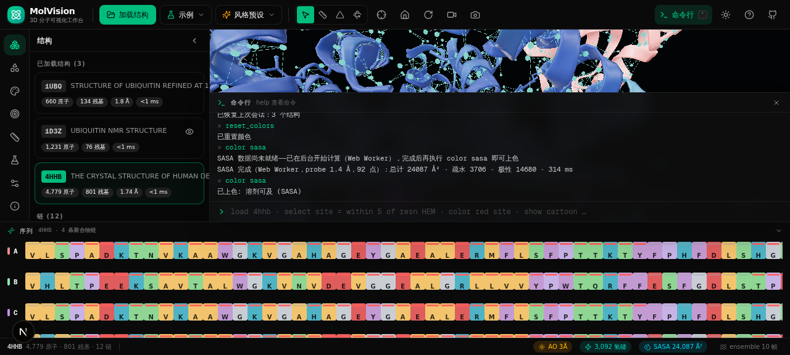

### PyMOL-style selection language
```
chain A and resi 40-80
chainidx 4                        # 5th chain segment (protein/ligand/water segments with the same chain ID stay isolated)
within 5 of (resn HEM)          # atoms within 5 Å of heme
byres(within 4 of ligand)       # expand to whole residues
(protein or nucleic) and not helix
name CA+CB · elem Fe · bfactor > 40 · backbone · metal
```
Full boolean grammar: `and or not ( )`, named selections, `byres`/`bychain`/`within` operators.

### Ligand-aware workflow
- **Chain segments** — the Structures panel chain list selects by *segment index* (`chainidx`): a ligand or water segment sharing a chain ID with a polymer never spills into the whole chain; duplicate IDs get `#n` badges, double-click focuses
- **Ligand chips** — click selects all copies + fit, double-click selects a single copy; a green **「口袋」 (pocket) button** grabs the full 4.5 Å binding site in one click (`byres(within 4.5 of resn HEM)`)
- **Sequence-bar ligand row** — amber chips (e.g. `HEMA142`) pinned above polymer sequences: each chip is one complete small molecule, click to select / double-click to focus
- **Right-click environment** — context menu (rebuilt crash-free) with atom/residue/chain-segment/same-residue/5 Å-surroundings selection, distance measurement and labeling

### Command console (press `` ` ``)
```
load 4hhb
select site = within 5 of resn HEM
color red site
show cartoon chain A
zoom site
bg black · spin on · rock on · slab 20 · label on · preset surface
ssao on 3 · hbonds on 3.2 · ensemble play · ensemble fps 15
superpose 4hhb onto 2hhb · superpose 4hhb onto 1a3n chain A to A · activate 1bql · record start · morph m1 = 1bql 2lyz 40 · morph multi m = 1bql 2lyz 2vb1 60 · movie play 4 2 · movie edit
interface A B · interface chain A chain B · contacts chain A | chain B 4.0 · contacts ligand | polymer 4.5 · dssp
preset publication · view from ligand · view from (resn HEM and chain A) · outline on 0.5 1 · ray 2400
xcontacts 1ubq:chain A | 1d3z:chain A 5.0 · sasa 1.4 256 · color sasa · bsa · xbsa · untransform 1d3z
map fetch 3ekj · map fofc 3ekj · map isolevel 1.5 · map isolevel pos 3 / neg 2.5 · map mesh · symmetry 20 · symmetry off
create pocket = within 5 of resn HEM · split_chains · save model.pdb chain A
orient chain A · get_view · png 4 · ray 1920 · count_atoms chain A · tour quickstart · tour stop
set ambient 0.5 · set specular off · set fov 30 · stereo on · util cbaw
```

### Measurement & annotation
- **Distance / angle / dihedral** measurement with 3D labels — click atoms in measure mode, or command/agent-driven: `measure dist (resn HEM) (within 5 of resn HEM and protein)` (closest atom pair between selections; centroid-nearest atom for angles/dihedrals), `measure clear`
- Atom **labels** (press `L` on a selection)
- **Sequence viewer** with per-residue biochemical coloring, secondary-structure track, click-to-select / double-click-to-focus, residue search (`A57` / `57` / `HEM`)
- **Context menu** (right-click): select atom/residue/chain/same-residue, measure-from-here, label, focus

### AI drawing assistant (toolbar "AI 助手" / natural language)
Every feature of the workbench is reachable through natural language — loading, representations, coloring, selection, measurement, analysis, conformation morphing, movies and exports are all translated into whitelisted commands and auto-executed on the exact same code path as the console:
- **Command cards** audit each executed command (status icon, expandable output, re-run; destructive commands require explicit confirmation)
- **Visual self-check (bounded double-check)** — after commands run, a screenshot is sent to a vision model that verifies the render against your goal and issues correction commands; the corrections are themselves re-checked once more, so the loop converges to the intended look (Eye toggle in the panel header). Goals that include a publication image always re-`ray` after corrections
- **Publication recipe** — "出版级 / 互作图" requests follow a battle-tested pipeline: `contacts ligand | polymer 4.5` (interaction analysis) → `preset publication` (chain-colored cartoon + CPK ball-stick pocket, clears stale baked colors) → `view from ligand` (pocket straight at the camera, adaptive close-up distance, auto-picks the nearest ligand instance in multi-ligand assemblies) → `bg white` + `outline on 0.5 1` (measured VLM-optimal subtle edging) → `ray 2400` last
- **Incremental adjustment** — "再粗一点 / 再亮一点" style requests compute new absolute values from the current numeric settings in the scene context
- **Auto-retry-fix loop** — failed commands are fed back to the LLM for one correction round; graceful degradation salvages commands from prose replies when the JSON protocol drifts
- **34 model providers, auto model discovery** (assistant header → provider settings) — a two-pane directory (categorized: international / CN / aggregators / local) covering OpenAI, Anthropic, Google, xAI, Mistral, Groq, Cohere, Perplexity, Together, Fireworks, DeepInfra, Cerebras, NVIDIA NIM, GitHub Models, DeepSeek, Qwen, Kimi, Zhipu GLM, Doubao, MiniMax, Hunyuan, Baichuan, StepFun, Yi, ERNIE, Spark, ModelScope, Gitee AI, OpenRouter, SiliconFlow, Ollama, LM Studio and any custom OpenAI-compatible gateway. **Paste an API key and the workbench probes the provider's `/models` endpoint** — the real model list (with context windows, grouped by chat/embedding/image/audio kinds) drops into a searchable picker; the discovered list is persisted per provider. Keys are stored server-side only (`.molvision/`, 0600, masked in the UI; env-var fallback supported per provider)

### Interface analysis (Analysis panel / `interface` command)
- Contact detection between arbitrary selections with adjustable cutoff (3–8 Å)
- **2D contact map** heatmap (rows = A-side residues, columns = B-side) — hover for residue pair + distance, click to select that pair in 3D
- One-click selection of A-side / B-side / all interface residues
- **ΔSASA buried-area analysis** — per-side burial (Ų), total interface BSA, core interface residues at the PDB-standard ΔSASA > 1 Ų criterion, one-click core-residue selection
- **SASA panel** — total / hydrophobic / polar / water+ligand areas with composition bar, Top-12 exposed residues (click to select), probe radius (0.8–2.0 Å) and sampling density (64–256 pts/atom) controls
- Secondary-structure composition bar (helix/strand/loop) + DSSP recompute

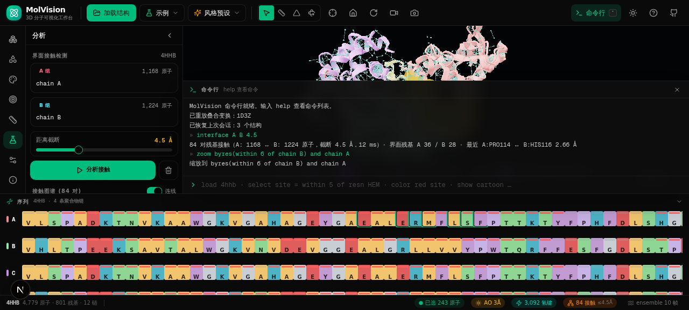

### Session persistence & `.molvision` files
Structures, representations, colors, settings, **superposition transforms**, camera orientation and **electron-density-map state** (SF source, σ levels incl. independent positive/negative, mode, colors — recomputed automatically in the Worker on reload) are auto-saved to localStorage (debounced) and restored on reload — no work lost. Manage with `session save / info / clear`.

Full sessions can also be **exported as `.molvision` files** (complete structure sources + view state + view bookmarks) and re-imported on any device — toolbar **Session menu** → Save/Open session file (also `session export`, drag-and-drop a `.molvision` onto the viewport, or the load dialog); imported files replace the current bookmarks when the file carries them.

**New session** (Session menu or `session new`) closes every structure and clears selections, measurements, labels, named selections, view bookmarks, movie timeline, density maps and the local archive — with a confirmation dialog when structures are loaded; an in-progress animation recording is saved first.

**Closing structures**: the always-visible **X button** on each structure card closes that structure with an **8-second undo toast** (representations, colors, superposition transform and symmetry mates are snapshot-restored); *Close all* batch-clears with confirmation. Console: `close` (active) / `close 4HHB` / `close all`.

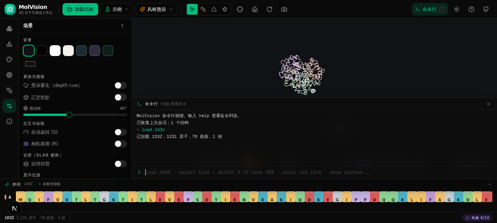

### Scene & camera
- **Light theme by default** (dark theme one click away) — viewport background follows the theme automatically
- **GTAO ambient occlusion** — ground-truth AO post-processing darkens crevices, pockets and contact regions for dramatically improved depth perception; adjustable intensity & sampling radius (Å-scale, `ssao on 3`)
- **Adjustable three-point lighting** — ambient (env-map) / key / fill sliders + specular on/off for matte publication rendering
- **Red-blue stereo anaglyph** — true 3D depth with red/cyan glasses (`stereo on`)
- **Structure superposition** — align any two structures by sequence + rigid-body fit; try `load 1ubq` then `load 1d3z` then `superpose 1ubq onto 1d3z` (ubiquitin X-ray ↔ NMR, ≈ 0.5-1.5 Å RMSD); aligned poses survive reload
- **Animation recording** — capture molecular motion as WebM video (toolbar ⏺ / `record start`)
- Perspective/orthographic toggle, FOV control, **PyMOL `orient`** principal-axis view alignment
- **Depth-cue fog**, **slab clipping** (near/far planes along the view axis — also clips the density map)
- Auto-rotate (spin `S`), **camera rock** (`R`, ±26° oscillation for inspecting pockets & grooves), background presets, 2×/4×/transparent PNG export
- Hide/show hydrogens & water globally

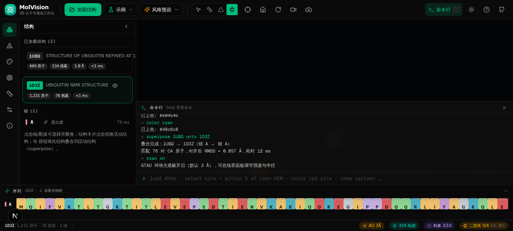

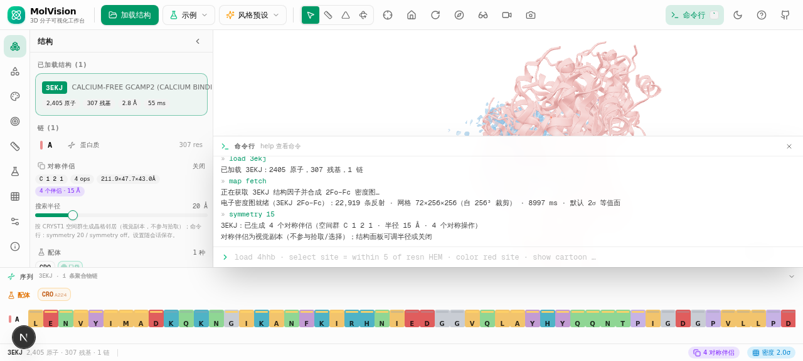

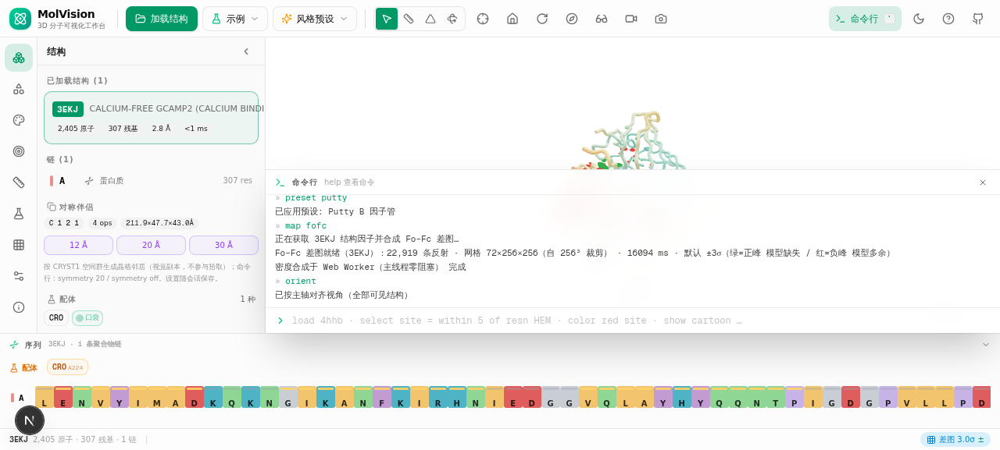

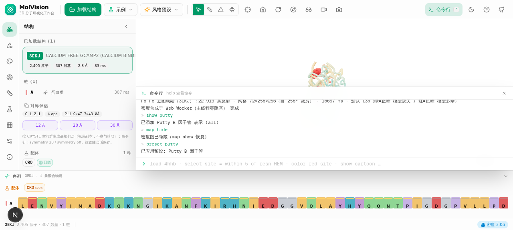

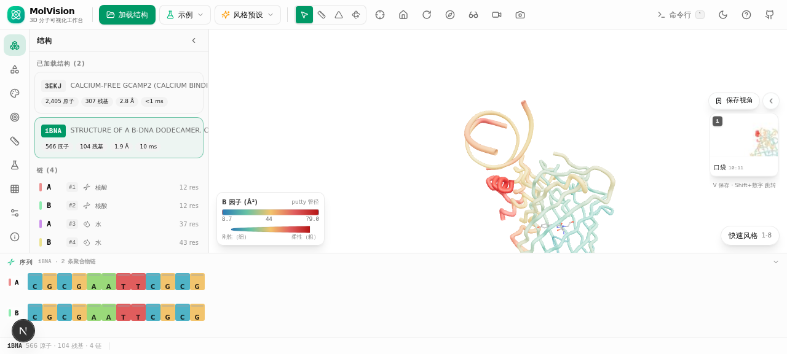

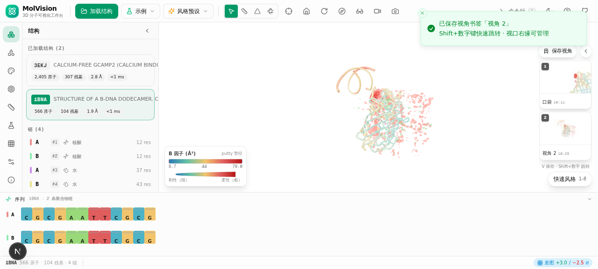

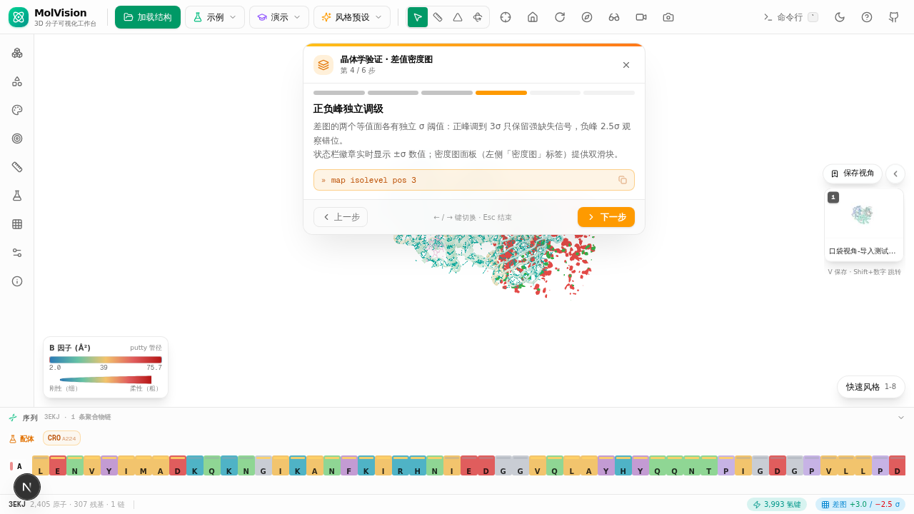

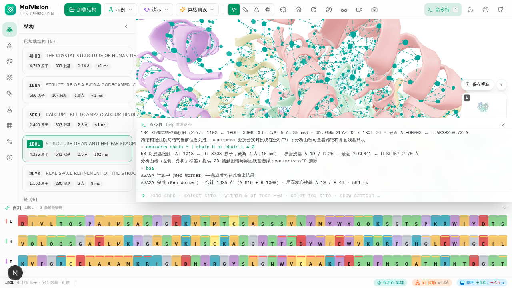

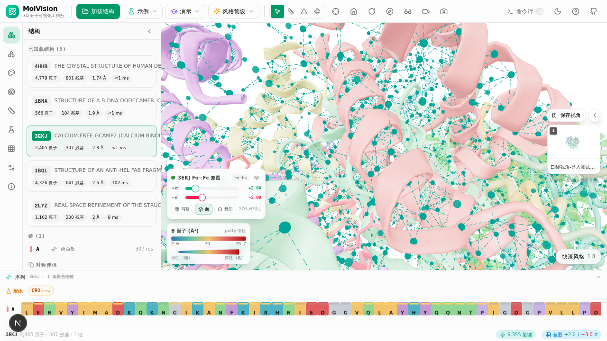
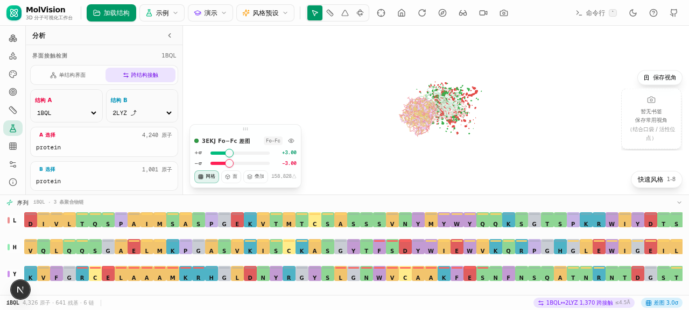

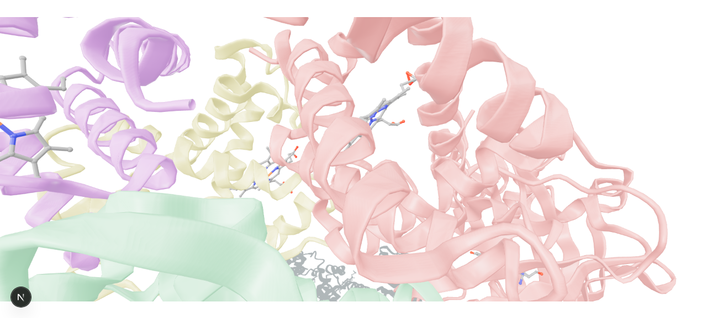

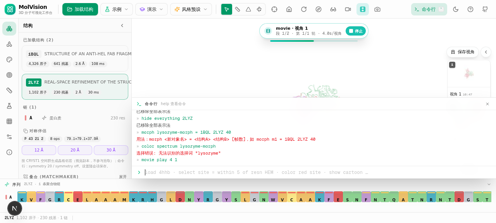

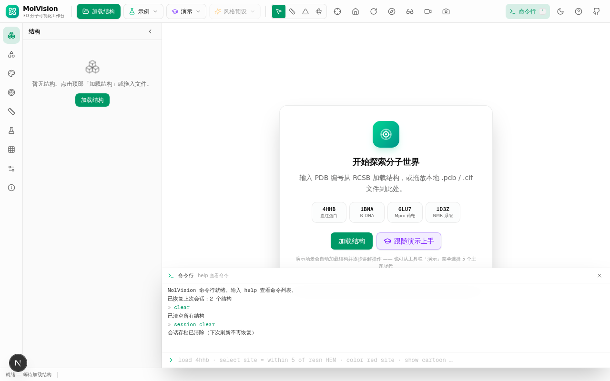

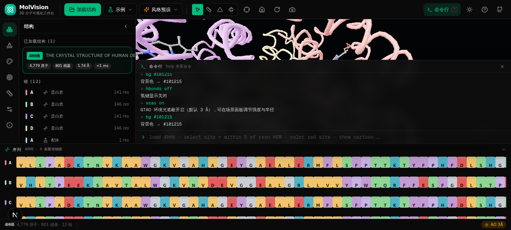

## ⌨️ Shortcuts
`1-9` presets (`6` = binding site, `7` = publication-ready protein–ligand view, `9` = putty B-factor tubes, protein + nucleic) · `F` fit view · `S` spin · `R` rock · `H` hydrogens · `W` waters · `B` hydrogen bonds · `P` ensemble play/pause · `L` label · `V` save view bookmark · `Shift+1-9` jump to bookmark · `→/←` tour step (during a demo) · `` ` `` console · `Esc` exit mode/clear/end tour/stop movie/close timeline · `Ctrl+click` single atom · `Shift+click` add · `Alt+click` remove · double-click focus residue

## 🚀 Quick start

```bash
bun install
bun run dev        # http://localhost:3000
```

Paste a **PDB ID** (e.g. `4HHB`) or drag & drop a local `.pdb` / `.cif` file onto the viewport.

## 🏗️ Tech stack
- **Next.js 16** (App Router) + React 19 + TypeScript
- **Three.js** — InstancedMesh geometry, PMREM environment lighting, ACES tone mapping, clipping planes, MarchingCubes surfaces & density isosurfaces, GTAO post-processing (EffectComposer), AnaglyphEffect stereo
- **Crystallography engines** — SF mmCIF reflection parser, model-phase 2Fo−Fc / Fo−Fc synthesis via in-house radix-2 3D FFT (Web Worker), CCP4/MRC map reader (axis permutation + endianness), 65 Sohncke space-group operation tables, PDB-convention orthogonalization
- **Web Workers** for hydrogen-bond detection, SASA/ΔSASA computation and electron-density synthesis (SF parse + 3D FFT) — heavy analysis never blocks the UI
- **DSSP** secondary-structure engine (Kabsch–Sander electrostatic H-bond energies)
- **Shrake–Rupley SASA** engine (FreeSASA-equivalent) with three-pass ΔSASA interface analysis
- **Zustand** state · **shadcn/ui** + Tailwind CSS 4 · **sonner** toasts
- Zero-backend parsing: PDB & mmCIF parsed in-browser; RCSB fetched through tiny API proxies (`/api/pdb/[id]`, `/api/sf/[id]`)

## 📁 Structure
```
src/lib/molecular/   parser (PDB/mmCIF/CRYST1) · chemistry data · selection engine ·
                     color schemes · representations · renderer engine · store ·
                     commands · DSSP · contacts · superpose · hbonds (worker) ·
                     sasa + ΔSASA (worker) · sffourier (2Fo−Fc FFT) · ccp4 (map reader) ·
                     marching-cubes · symmetry (65 space groups) · pdbwriter · map-load ·
                     tours (guided demo scenarios) · views-store (camera bookmarks)
src/components/
  molecular/         WebGL viewport wrapper (picking, hover, context menu, shortcuts)
  studio/            toolbar · panels (structures/reps/colors/selection/measure/analysis/maps/scene/info) ·
                     sequence bar · command console · status bar · dialogs
src/app/             single-page studio + /api/pdb + /api/sf proxies
```

## 🗺️ Roadmap
- Fo−Fc difference maps (negative/positive peaks) · cross-structure ΔSASA (joint buried area after superpose) · iterative multi-chain matchmaker (auto chain-pair iteration) · map-box cartoon clipping (PyMOL `cartoon_rect` density style) · ensemble GPU-matrix playback for very large systems · unified Web Worker pool for hbond/SASA/contacts/maps

## License
MIT
